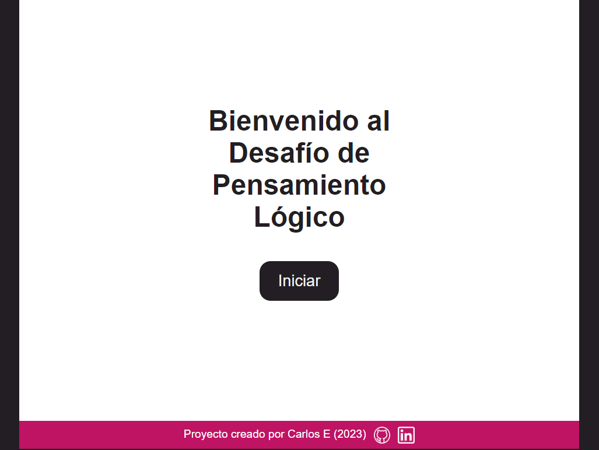

# Desafíos de Pensamiento Lógico 🧠💡

En este proyecto veremos una serie de desafíos de pensamiento lógico, los cuales podemos encontrar en el **[Curso de Pensamiento Lógico de Platzi](https://platzi.com/cursos/pensamiento-logico-desafios/)**.

* Te invito a resolverlos y recuerda: **#NuncaParesDeAprender**

    
    
Página principal del proyecto

